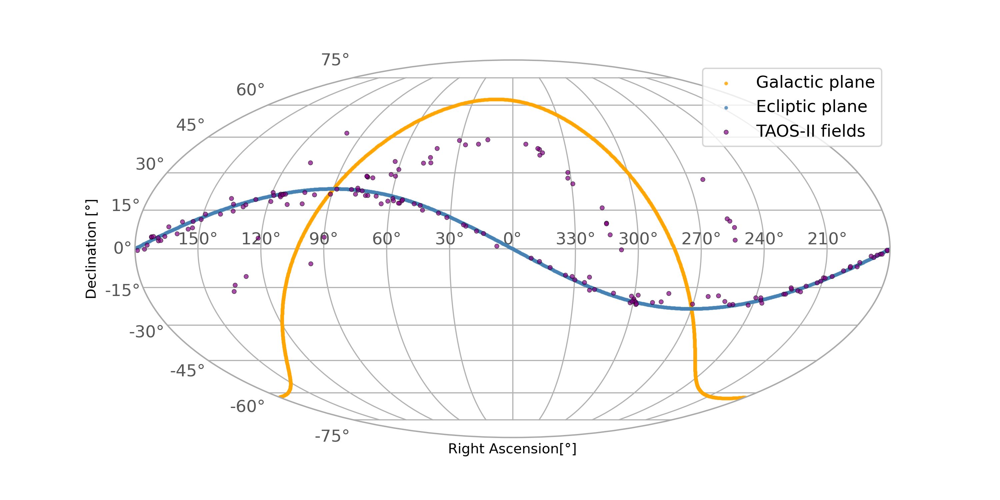

# COTTONTAIL

COordinaTes crossmaTch ON TAos fIeLds

## Description 

COTTONTAIL is aimed to help you find if your objects are on the [TAOS-II's](http://taos2.astrosen.unam.mx/) fields of vision. It will make a crossmatch of coordinates between a list of object given and the TAOS-II field of vision, located in [San Pedro Martir National Astronomical Observatory](https://www.astrossp.unam.mx/index.php/en/).
TAOS-II has the same fields of vision as the first TAOS project, bases in Taiwan.

## TAOS-II fields fo vision 
The fields of vision data of TAOS-II are in the TAOS_fields.csv file. We add a program to plot the TAOS-II fields, to run the program run:
```console
%run PLOT_TAOSII_fields.py
```
and you will get a plot like this:


## Installation
### Before running COTTONTAIL
Just open the shell, get to the root directory of COTTONTAIL and type:

```console
$ make
```

## Running COTTONTAIL
If you have Linux (or bash installed on your PC) and IPython (or python3) installed, just get into the COTTONTAIL root directory and run the COTTONTAIL code as:  

```console
%run COTTONTAIL.py
```

### How to use?

After running the python file, call the function 'crossmatch' with the name of the file of your objetives coordinates (in .csv format) and with a boolean argument meaning:
* 0: if your objective coordinates are con Equatorial coordinate system (Right ascention and Declination)
* 1: if your objective coordinates are con Galactic coordinate system (Galactic longitude and galactic lattitude)

```console
crossmatch(file,coor_bool)
```
*Being file a kwargs without the extention .csv 

## Contributing
If you want to contribuite feel free to clone the repository and push your improvements.

## Credits 
This tools was develop by Sebastian Carrazco, advised of Dr. Yilen Gomez Maqueo, as part of his Professional practice internship at [Instituto de Astronomía UNAM](http://www.astroscu.unam.mx/IA/index.php?lang=en) and **B.Sc. thesis** under the supervision of Dr. Gomez Maqueo and Dr. Margarita Pereyra.

Please if you use this program for your research cite my thesis:
* J. S. Carrazco. Estudio preliminar de los proyectos TAOS-II y DDOTI para la búsqueda de exoplanetas transitantes desde el OAN-SPM. (Universidad Autónoma de Sinaloa, Culiacán. 2021 expected)

## License
This tool has the license GNU General Public License v3.0 (GNU GPLv3).
